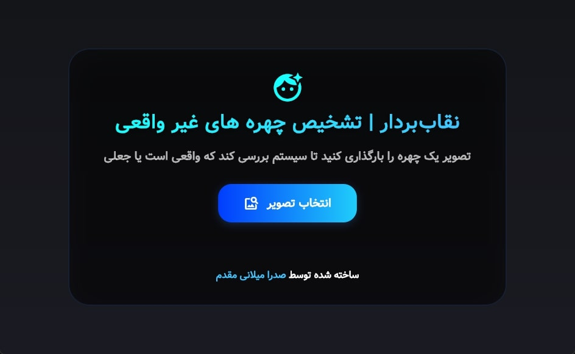

# نقاب بردار

این پروژه توسط **صدرا میلانی مقدم** توسعه داده شده است.



## توضیحات پروژه

در این پروژه یک مدل یادگیری عمیق با هدف تشخیص چهره‌های واقعی از جعلی پیاده‌سازی شده است. برای آموزش مدل، از دیتاست جامع [140K Real and Fake Faces](https://www.kaggle.com/datasets/xhlulu/140k-real-and-fake-faces) استفاده شده است. این دیتاست شامل 140,000 تصویر با کیفیت بالا از چهره‌های واقعی و جعلی است که بستر بسیار مناسبی برای آموزش مدل‌های تشخیص تقلب در تصاویر فراهم می‌کند.

## ویژگی‌های شاخص

- **دقت چشمگیر:** مدل توسعه داده‌شده به دقت (accuracy) معادل **0.91** در تست‌ها دست پیدا کرده است که بیانگر عملکرد بسیار قوی در تفکیک چهره‌های واقعی و جعلی است.
- **استفاده از سخت‌افزار مناسب:** فرایند آموزش مدل به کمک کارت گرافیک RTX 3060 با حافظه 12GB انجام شده است و زمان آموزش مدل به طرز قابل توجهی کاهش یافته است.
- **طراحی ماژولار:** ساختار پوشه‌بندی پروژه به گونه‌ای است که توسعه، تست و به‌روزرسانی مدل به سادگی انجام می‌شود.


## امکانات فنی

- استفاده از مدل‌های پیشرفته یادگیری عمیق و قابلیت Fine-tune مطابق نیاز پروژه
- اجرای بی‌نقص در کنار رابط کاربری Flutter برای استفاده ساده و سریع
- ارائه API برای ارتباط با پروژه اصلی

## نمونه خروجی

پس از آموزش و تست، مدل قادر است تصویر ورودی را تحلیل کرده و با دقت بالا واقعی یا جعلی بودن آن را اعلام کند.

: [لینک دیتاست](https://www.kaggle.com/datasets/xhlulu/140k-real-and-fake-faces)


## ساختار پروژه

NeghabBardar/
├── api/
│   └── modelapi.py           
│
├── flutter_interface/     
│   ├── assets/
│   ├── build/
│   ├── lib/
│   └── windows/
│
├── model/                         
│   ├── dataset/                    
│   ├── sdxl-detector-finetuned/   
│   ├── example.jpg
│   ├── predict.py
│   ├── test.py
│   └── train.py
│
├── venv/                         
├── requirements.txt              
└── run.bat                       

## آموزش مدل

```bash
pip install -r requirements.txt
```
```bash
cd model
python train.py
```

## استفاده از مدل در ترمینال و پیشبینی تصویر

```bash
pip install -r requirements.txt
```
```bash
python model/predict.py --image example.jpg
```

## نحوه راه اندازی و اجرای محیط گرافیکی (UI)

1. نصب وابستگی‌ها:

```bash
pip install -r requirements.txt
```

2. اجرای برنامه

برای اجرای برنامه کافی است روی فایل زیر دوبار کلیک کنید:

```bash
run.bat
```
